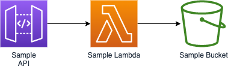

# {{cookiecutter.project_name}}

## Introduction
{{cookiecutter.project_description}}

## Prerequisites
- [CDKv2](https://docs.aws.amazon.com/cdk/v2/guide/home.html)
- [AWS CLIv2]()
- [Configure AWS CLI](https://docs.aws.amazon.com/cli/latest/userguide/cli-chap-configure.html)

## Description
<ADD PROJECT SUMMARY>

## Getting Started

To get started, please follow the [Bootstrapping Guide](./docs/bootstrapping-guide.md)

## Developer Guide (Build/Test/Deploy)

For more details on how to use this project, CDK and supporting tools, please see the [Detailed Developer Guide](./docs/developer-guide.md)

## Architecture

For detailed architecture breakdown, please see the [Architecture Guide](./docs/architecture-guide.md)

